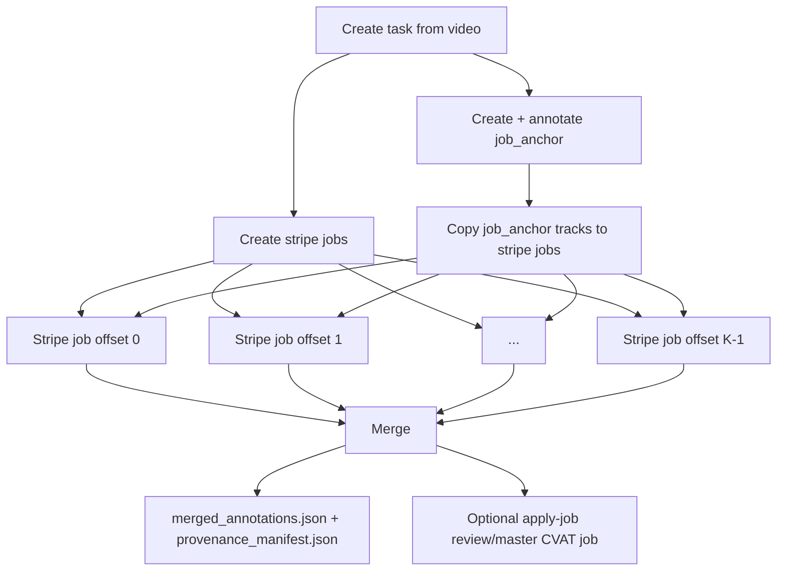

# CVAT Automation Runbook

This runbook describes the custom tracked-annotation workflow built on top of CVAT tasks and jobs.

## Environment

Set the CVAT host and one auth method:

```bash
export CVAT_HOST=http://localhost:8080
export CVAT_ACCESS_TOKEN=<token>
# or:
export CVAT_USER=<username>
export CVAT_PASSWORD=<password>
```

The helper `customization/scripts/cvat_api_env.py` reads these values for all scripts. Run commands from the CVAT repository root unless noted otherwise.

## Quick Workflow

### 1. Create Task And Jobs

From a video file (interactive wizard):

```bash
python3 customization/scripts/cvat_create_task_from_video.py --video /path/to/video.mp4
```

From a detectrack export folder (non-interactive; reads `manifest.json` + sibling `clip.mp4`):

```bash
python3 customization/scripts/cvat_create_task_from_video.py create \
  --manifest data/cvat_exports/<task_name>/manifest.json
```

Shortcut (same as `create --manifest`):

```bash
python3 customization/scripts/cvat_create_task_from_video.py \
  --manifest data/cvat_exports/<task_name>/manifest.json
```

The manifest drives CVAT task data:

| Manifest field | Script / CVAT usage |
|----------------|---------------------|
| `task_name` | CVAT task name |
| `cvat_step` | `frame_filter=step=N` |
| `cvat_start_frame_in_clip` | data `start_frame` |
| `class_names` | task labels |
| `num_stripe_jobs` | optional; stripe job count (default 6) |
| `anchor_job_size` | optional; `job_anchor` frame count (default `3 * num_stripe_jobs`) |

CLI flags override manifest values when both are given. The script checks `cvat_step == frame_decimation` and that `clip.mp4` exists next to the manifest.

The wizard asks for:

- `step`: CVAT frame sampling, stored as `frame_filter = "step=<step>"`.
- `task name`: CVAT task name.
- `num_stripe_jobs`: creates exactly `num_stripe_jobs` stripe jobs, one for each offset; default `6`.
- `anchor_job_size`: number of task-relative frames in `job_anchor`; defaults to `3 * num_stripe_jobs` unless explicitly specified.

Fixed defaults:

- `stop_frame=0`: import the full clip (logical sequence bounds are enforced on detectrack import).
- `start_frame`: from manifest `cvat_start_frame_in_clip` when using `--manifest`, else `0`.
- `image_quality=85`.
- `segment_size=0`: CVAT expands this to the task data size.
- `consensus_replicas=0`.

The script creates the CVAT task, uploads the video, deletes CVAT's default annotation jobs, then creates manual-frame jobs:

- `job_anchor`: frames `[0, 1, ..., anchor_job_size - 1]`.
- Stripe offset `0`: frames `[0, num_stripe_jobs, 2*num_stripe_jobs, ...]`.
- Stripe offset `1`: frames `[1, 1+num_stripe_jobs, 1+2*num_stripe_jobs, ...]`.
- Continue through offset `num_stripe_jobs - 1`.

Job frames are task-relative after `frame_filter` is applied, not original source-media frame numbers.

### 2. Annotate `job_anchor`

Complete tracked annotation in the first job. This job establishes canonical track identity: label, track order/index, and initial keyframes.

Stripe annotators should not start yet.

### 3. Copy Anchor Tracks To Stripe Jobs

Run this after `job_anchor` is complete:

```bash
python3 customization/scripts/copy_job_tracks_to_jobs.py --task-id <task_id> --assignees user1,user2,user3
```

The script infers jobs from the task:

- First annotation job by ID: `job_anchor`.
- Remaining annotation jobs: stripe target jobs.
- `--assignees` assigns target jobs round-robin by CVAT username.

Add `--dry-run` to inspect the inferred plan without writing annotations or assignments.

Important: this step overwrites each target job's current annotation payload. Run it before stripe annotators edit.

### 4. Annotate Stripe Jobs

Each stripe annotator edits only their assigned stripe job frames. They should refine existing copied tracks, not create new independent tracks for the same object.

### 5. Merge Completed Stripe Work

After `job_anchor` and all stripe jobs are complete:

```bash
python3 customization/scripts/merge_jobs_to_master_review.py --task-id <task_id>
```

This writes:

- `tmp/task-<task_id>/merged_annotations.json`
- `tmp/task-<task_id>/provenance_manifest.json`

Automatic selection includes only jobs where:

- `type == "annotation"`
- `stage == "annotation"`
- `state == "completed"`

`job_anchor` defines track identity. Stripe jobs contribute keyframes from all frames they own, including frames beyond `anchor_job_size`.

To also load the merged result into an existing review/master job:

```bash
python3 customization/scripts/merge_jobs_to_master_review.py --task-id <task_id> --apply-job <review_job_id>
```

`--apply-job` overwrites that review job's annotation payload.

### 6. Build Candidate Manifest

Optional but recommended for audit/review:

```bash
python3 customization/scripts/build_candidate_manifest.py --task-id <task_id>
```

This writes:

- `tmp/task-<task_id>/candidate_manifest.json`

The candidate manifest preserves individual annotator contributions before or alongside the merged result: raw tracks, owned frames, assignee info, candidate keyframes, and source-media frame mapping.

To attach final review/master annotations into the same manifest:

```bash
python3 customization/scripts/build_candidate_manifest.py --task-id <task_id> --admin-job <review_job_id>
```

## Why `job_anchor` And Stripe Jobs

Tracked annotation needs stable identity across the whole task. If every annotator independently creates tracks, the same object can end up with multiple unrelated track IDs.

`job_anchor` solves this by creating the canonical tracks first. After it is completed, its sparse track keyframe sequence is copied into all stripe jobs. Stripe annotators then refine existing tracks on their assigned frames.

Stripe jobs exist to split the refinement workload. With `num_stripe_jobs=K`, the task is split into `K` frame residues, so every task-relative frame is owned by exactly one stripe offset.



Example with `anchor_job_size=4` and `num_stripe_jobs=3`:

```text
job_anchor:      0, 1, 2, 3
stripe offset 0: 0, 3, 6, 9, ...
stripe offset 1: 1, 4, 7, 10, ...
stripe offset 2: 2, 5, 8, 11, ...
```

Stripe jobs can overlap `job_anchor` frames. That is expected. `job_anchor` provides identity; it does not limit merge coverage.

## Output Files

`merged_annotations.json`

- CVAT annotation payload containing merged tracks.
- Can be PUT into a review/master job with `--apply-job`.

`provenance_manifest.json`

- Explains which job supplied each merged frame/keyframe.
- Includes assignee info and task-to-source frame mapping.

`candidate_manifest.json`

- Keeps individual stripe annotator candidates.
- Useful for audit, comparison, and later review of disagreements.

## Script Summary

- `customization/scripts/cvat_create_task_from_video.py`: create task, upload video, create `job_anchor` and stripe jobs.
- `customization/scripts/cvat_interleaved_jobs.py`: rebuild manual-frame jobs for an existing task.
- `customization/scripts/copy_job_tracks_to_jobs.py`: copy anchor tracks into stripe jobs and optionally assign users.
- `customization/scripts/merge_jobs_to_master_review.py`: merge completed annotation-stage jobs.
- `customization/scripts/build_candidate_manifest.py`: preserve candidate annotations and optional final review annotations.
- `customization/scripts/cvat_api_env.py`: shared CVAT auth/session helper.
- `customization/scripts/cvat_frame_map.py`: task-frame to source-frame mapping helpers.

## Useful Checks

Check recent tasks:

```bash
curl -s -H "Authorization: Bearer $CVAT_ACCESS_TOKEN"   "$CVAT_HOST/api/tasks?page_size=20&ordering=-id"   | jq '.results[] | {id, name, size, created_date}'
```

Check one task:

```bash
curl -s -H "Authorization: Bearer $CVAT_ACCESS_TOKEN"   "$CVAT_HOST/api/tasks/<TASK_ID>" | jq '{id, name, size}'
```

Check task names directly in DB:

```bash
docker compose exec cvat_server python manage.py shell -c "from cvat.apps.engine.models import Task; print(list(Task.objects.order_by('-id').values_list('id','name')[:20]))"
```

After script changes:

```bash
python3 -m py_compile customization/scripts/cvat_create_task_from_video.py customization/scripts/cvat_interleaved_jobs.py customization/scripts/copy_job_tracks_to_jobs.py customization/scripts/merge_jobs_to_master_review.py customization/scripts/build_candidate_manifest.py
```
